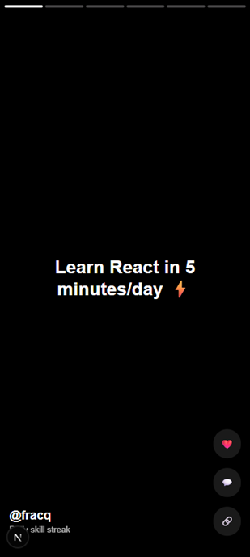

# Fracq: The AI-Powered Fractional Learning & Talent Marketplace 🚀

**Learn in 5 minutes. Earn in 5 hours.**



Fracq is a hyper-efficient platform designed to bridge the gap between high-income skills and real-world income. We turn long, boring courses into addictive, 5-minute daily "streaks" and connect learners directly to fractional (part-time) work opportunities worldwide.

**How to run**

## 🚀 How to Run

1. **Install Node.js & npm**  
   Download and install from [https://nodejs.org/en](https://nodejs.org/en)

2. **Install dependencies**  
   ```bash
   npm install
   ```

3. **Run the development server**
   ```bash
    npm run dev
   ```  
4. **Open in browser**
    Visit http://localhost:3000

---

## 💡 The Big Idea
Traditional education is too slow. Online courses have low completion rates. Fracq solves this by:
1. **Micro-Learning:** TikTok-style, AI-personalized daily streaks.
2. **Fractional Talent:** Once you hit a skill milestone, you enter our marketplace to sell 5–20 hours of your week as a developer, marketer, or designer.
3. **Viral Rewards:** Success stories automatically turn into social proof to onboard the next million builders.

## 🛠️ Tech Stack (The "Lean & Mean" Setup)
We are building in public with a focused, high-performance stack:
- **Frontend:** [Next.js](https://nextjs.org/) (App Router) + [Tailwind CSS](https://tailwindcss.com/)
- **Backend/DB:** [Supabase](https://supabase.com/) (PostgreSQL + Realtime)
- **Auth:** [Clerk](https://clerk.com/)
- **AI/Search:** [Pinecone](https://www.pinecone.io/) (Vector search for skill matching)
- **Deployment:** [Vercel](https://vercel.com/)
- **Observability:** [PostHog](https://posthog.com/) & [Sentry](https://sentry.io/)

---

## 📈 Current Status: Phase 1 (The Digital Flag)
- [x] Brand Identity & X Account (@FracqAI)
- [x] GitHub Organization Setup
- [ ] MVP Landing Page (fracq.vercel.app) - **In Progress**
- [ ] Waitlist & Authentication Integration
- [ ] Basic Streak Logic & AI Pathfinding

## 🤝 Join the Core Team
We are actively looking for "Day 0" contributors (Equity + Revenue Share):
- **Full-Stack Devs:** (Next.js, Supabase, Vercel expert)
- **Growth Hackers:** (Viral marketing on TikTok/X)
- **Payments Experts:** (Stripe & Paystack integration)

If you believe in democratizing access to high-income skills, **DM us on X [@FracqAI](https://x.com/FracqAI)** or open a PR.

---

## 🌍 Building In Public
Fracq is founded by **Yunusa Mohammed** in Lagos, Nigeria. We believe the future of work is fractional, decentralized, and driven by skill-first builders.

**#BuildInPublic #Fracq #FractionalEconomy**
